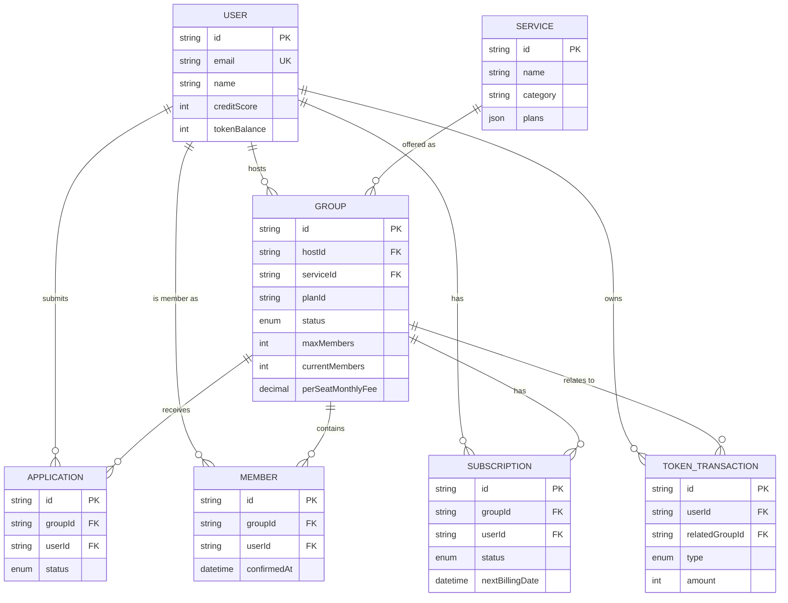

# 資料庫 Schema 與狀態流程

資料庫使用 **MySQL 8**，以 **Prisma ORM** 管理 schema。

## 核心領域 ERD

只畫交易流程真正會用到的 7 張表；`Notification`／`Favorite`／`Conversation`／`Message`／`Review`／`CredentialComment`／`CreditScoreLog` 等次要表未列入（各自只跟 `User`／`Group` 有一對多關聯，不影響核心交易邏輯）。

`Group.status` 即群組狀態機（見下方「群組狀態機」）；群組另外記錄目前代管中、尚未撥款的 PM 幣總額，跟 `TokenTransaction` 的逐筆流水互為對帳依據。共用帳密、成員服務帳號等敏感內容各自存放在對應資料表中，落地儲存前會經過加密處理，並依角色動態遮罩後才回傳給前端，圖為簡化呈現、未列出全部欄位。

## 主要資料模型

- **User**：帳號、個人資料、信用分數、平台 PM 幣餘額、隱私與線上狀態設定
- **Service**：訂閱服務目錄與方案
- **Group**：群組主資料，含狀態機、名額、代管金額等欄位
- **Application**：加入群組的申請紀錄
- **Member**：群組成員與其服務帳號資訊
- **Subscription**：成員的訂閱狀態與扣款週期
- **TokenTransaction**：PM 幣交易審計日誌
- **Notification**：個人通知與系統公告
- **Favorite**：收藏群組
- **Conversation / Message**：群組聊天室、私訊與系統訊息
- **Review**：團主與成員之間的可選評價，可在服務確認後補評或更新
- **CredentialComment**：帳號資訊分頁的留言

## 隱私設計

使用者可關閉「顯示大頭照」，後端在把使用者資料回傳給「別人」看時會遮罩對應欄位，本人查看自己的資料不受影響。

## 群組狀態機

`recruiting`（招募中）→ `full`（等待鎖定）→ `pending_confirmation`（填寫帳號資訊）→ `pending_activation`（待啟用服務）→ `confirming`（確認進行中）→ `active`（服務進行中）。`recruiting`／`full` 可轉往 `cancelled`；`pending_confirmation`／`pending_activation` 逾期分別轉往 `info_overdue`／`activation_overdue` 這兩個待處理狀態，不會自動移除成員、不會退回上一階段、也不會扣任何人的信用分數，改由團主／成員自行延長期限、修正資料、補按啟用或回報問題解決；`confirming` 可轉往 `disputed`（申訴，可由團主與成員自行協調解決、團主標記回報不實送交仲裁，或由平台管理員裁定，皆回到 `active`／`confirming`）；`active` 續訂時若有成員不續訂會轉往 `replacement_recruiting`（補位進行中，只釋出離開者的名額，鎖定後回到 `pending_confirmation`），全員續訂則直接回到 `pending_confirmation`；也可轉往 `ended`。

## PM 幣與代管機制

平台使用內部 PM 幣（1:1 對應台幣）作為交易媒介，所有金流在平台內部流轉，不涉及外部金流。申請加入群組時即代管扣款，團主接受申請不重複扣款；拒絕/取消/移除則退款。服務啟用後進入確認期，成員確認或期限到期後撥款給團主；成員如有爭議可申訴，由客服裁定。續訂會重新走一輪代管與確認流程。目前儲值為模擬模式，尚未串接真實金流。

## 已知限制

- Google OAuth 尚未串接；信件發送流程已保留可替換介面，開發環境以後端 log 輸出內容
- PM 幣儲值為模擬模式
- 確認期自動撥款採惰性求值，非排程任務
- 訊息中心採用短週期 polling，非即時推送
- 有一個獨立於一般導覽之外的管理員後台，提供平台總覽統計、系統公告/私訊發送、申訴裁定
