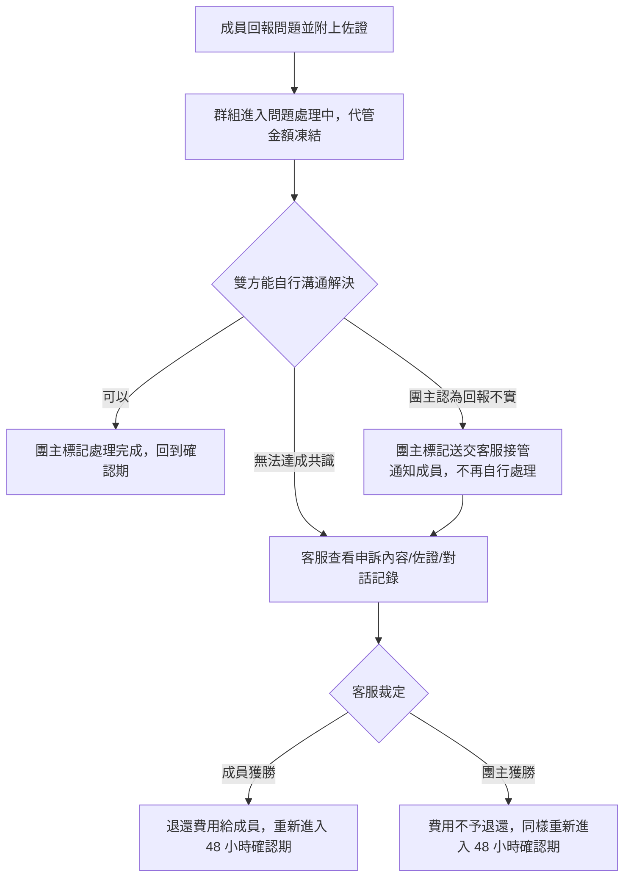

# 申訴流程

## 使用者目標
成員在確認期內如果發現服務沒有正常啟用、或有其他問題，可以正式回報，凍結代管款項讓團主跟成員雙方有機會先自行溝通解決；真的無法達成共識、需要第三方仲裁時，才由客服裁定金流歸屬，避免僅憑團主單方陳述作為依據。

## 流程圖

## 流程
1. 成員在確認期內點擊「回報問題」，複選問題原因、填寫說明，並**必須**附上截圖佐證
2. 送出後群組進入問題處理中狀態，代管金額暫時凍結不動，團主與成員收到通知
3. 團主與成員可以在專屬的留言區直接溝通，確認問題解決後，團主可以標記「處理完成」，讓群組回到確認期、成員重新獲得一段確認窗口——不需要每次小問題都送交客服
4. 團主如果認定是回報不實，也可以主動標記送交客服接管：通知成員問題進入仲裁、成員端畫面改顯示「客服處理中」，團主自己則不能再標記處理完成或改變心意，這一步是選擇性的，不標記客服一樣能在期限內直接裁定
5. 若雙方無法達成共識，客服在後台可以看到完整的申訴內容、佐證附件與雙方對話記錄，據此二選一裁定，不再只是憑群組編號盲選：
   - 成員獲勝：費用全額退還給成員，其餘成員不受影響
   - 團主獲勝：該筆費用不予退還
   - **不論哪一方獲勝，裁定當下都不會馬上撥款給團主**——該成員都會重新獲得一段 48 小時確認期，需要自己確認服務（或逾期）才會真正撥款，裁定不能讓系統代替成員蓋章「已確認」
6. 裁定結果會通知雙方，並在群組留言區留下裁定說明（只有團主跟該申訴成員看得到，其他成員看不到），同時留下一筆結構化的裁定紀錄，供客服後續查詢歷史案件

## 產品決策
- **申訴必須附上佐證截圖**：避免缺乏依據的申訴，讓裁定有明確憑證
- **裁定逾期不會自動判定**：任何一方獲勝都可能對另一方不公平，寧可讓管理員手動處理，也不自動代為決定，只是把逾期案件優先排到管理員的處理清單最前面
- **裁定影響範圍精準限定在申訴的那位成員身上**：其餘成員的代管與訂閱完全不受牽連
- **裁定結果二選一，沒有部分退款，也不會把任何一方移出群組**：裁定的重點只有金流歸屬，不影響成員資格——成員獲勝拿回這期費用，團主獲勝則該筆費用不予退還，但無論哪種結果，申訴成員都繼續留在群組內，能持續收到群組聊天室訊息

## 驗證重點
- 送出申訴要求群組正處於確認期、且請求人確實是該群組成員
- 裁定只有客服（管理員）能操作
