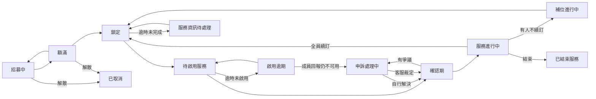

# 群組狀態機

## 概念

一個群組從建立到結束，只會照固定的順序推進，不會跳步驟：招募中 → 等待鎖定 → 鎖定（依共享模式完成服務設定資訊）→ 待啟用服務 → 確認進行中 → 服務進行中 → 續訂或結束。不同服務可能需要 Email、Apple ID、Google 帳戶、邀請碼，或由團主提供共用帳密，但都接在同一條群組狀態機上，詳細分類見 [共享模式](../product/sharing-modes.md)。中途如果成員退出釋出名額，等待鎖定的群組會退回招募中；確認期內若成員回報問題，會先進入申訴處理——雙方自行溝通解決就直接回到確認進行中，重新給一段確認窗口；真的無法達成共識才由客服裁定，裁定完同樣回到確認進行中（重新給該成員一段確認窗口，不會直接跳到服務進行中，避免客服代替成員確認服務沒問題）。服務設定跟待啟用兩個階段都設有期限，逾時會先進入各自的「待處理」狀態，改由團主／成員用延長期限、修正資料、補按啟用、回報問題等方式人工解決，不會自動處罰任何一方，詳見下方「設計重點」。續訂時如果有成員不續訂，只會釋出那些名額進入補位進行中，不會整團重新開放招募。

## 設計重點

- **每個階段轉換都有明確的前置條件與唯一觸發者**（多半是團主的操作，或成員自己的動作），不允許跳過步驟；少數逆向轉換是刻意設計的例外（名額被釋出退回招募中、逾時進入待處理狀態），且都對應到明確的觸發條件，不是隨意允許任意逆轉
- **服務設定階段依共享模式變化**：主流程不為每個服務拆成不同狀態，但服務設定期間要做的事會依共享模式改變，例如填 Email、填 Apple ID、產生邀請碼，或提取團主提供的帳密
- **確認期的自動撥款是「惰性」觸發的**：只要有人讀取到這個群組已經超過確認期限，系統即會一併完成撥款，不需要額外的排程機制去主動掃描
- **服務設定與待啟用逾時都只進入「待處理」狀態，不會自動處罰任何一方**：兩個階段都設有固定期限，逾時同樣是惰性觸發、有明確上限，但只會轉進對應的待處理狀態並提醒相關的人，不會自動移除成員、不會退回上一階段、也不會扣任何人的信用分數，改由團主／成員自行用延長期限、修正資料、補按啟用、回報問題等方式處理
- **申訴處理有兩條出路，結果都回到確認期而不是直接進入服務進行中**：團主與成員能自己在留言區談好就直接回到確認期，不動任何金流；無法達成共識才交由客服裁定金流歸屬，但裁定只解決錢該退還是不退還，該成員仍要自己重新確認服務才算真正結案
- **補位進行中不等於重新開團**：續訂時只有不續訂的成員會釋出名額進入補位進行中，其餘續訂成員資格保留不受影響，補位補滿後跟第一次招滿一樣走鎖定流程
- **PM 幣的代管、撥款、退款會跟著群組狀態一起走**：進入代管的時機、撥款給團主的時機、退款給成員的時機都對應到特定的狀態轉換，詳見 [PM 幣代管與付款流程](./payment-token-flow.md)
- 部分狀態轉換路徑（例如申訴處理中直接轉為已取消或已結束服務）目前在設計上是允許的，但前端還沒有對應的操作入口
