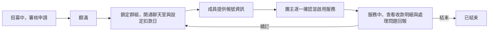

# 群組管理（團主視角）

## 使用者目標
團主管理自己建立的群組：審核申請、鎖定群組開始收款、啟用服務、查看收款明細、回報成員帳號問題，以及在服務期滿後決定續訂或結束群組。

## 流程圖

## 流程
1. **招募中**：審核申請（見 [團主審核流程](./approval-flow.md)），可移除已接受的成員釋出名額，也可以在鎖定前解散整個群組（全額退款）
2. **鎖定群組**：名額額滿後，團主可以鎖定群組——建立聊天室、依服務的 [共享模式](../product/sharing-modes.md) 讓成員提供 Email、Apple ID、Google 帳戶、邀請碼，或由團主先提供結構化的共用帳密資訊
3. **啟用服務**：全員完成服務設定資訊後，團主逐一確認無誤才能啟用，進入一段確認期；啟用的同一刻才會確定下次扣款日，不分首次或續訂後啟用都是由團主依外部平台實際扣款日期自行填寫，通知全員；服務設定與啟用兩個階段都設有期限，逾時不會自動處罰任何一方，只會先轉進對應的待處理狀態提醒相關的人，改由團主／成員自行延長期限、修正資料、補按啟用或回報問題解決，詳見 [群組狀態機](./group-state-machine.md)
4. **服務中**：查看收款明細（代管中／已撥款金額）、處理成員回報的帳號問題；確認期內如果臨時需要延後收費，團主可以手動調整一次下次扣款日（限往後延、有天數上限）；已經確認過服務的成員會被要求針對新日期重新確認一次，避免舊的確認被套用在異動後的日期上
5. **續訂或結束**：服務期滿後由團主決定，詳見 [續訂流程](./renewal-flow.md)

## 產品決策
- **鎖定與解散是不同等級的操作**：鎖定是雙向確認的一般操作，解散這種不可逆的動作則需要倒數確認才能執行
- **收款明細只呈現「目前」狀態**：只看每位成員最新一筆代管紀錄，不混入歷史上取消重新申請留下的舊紀錄，畫面才不會讓團主誤判
- **群組卡片欄位固定統一**：群組狀態、群組人數、建立日期或扣款日期三格固定顯示，不再依階段切換成不同欄位，狀態本身已經有獨立的一格顯示，不需要再疊加徽章重複表達
- **成員重複操作不會洗版團主的通知**：成員反覆查看帳號資訊等會通知團主的動作，改成更新既有的通知/留言而不是逐次新增

## 驗證重點
- 所有團主專屬操作都會驗證請求人確實是該群組團主
- 鎖定、啟用、解散、續訂各自只允許在對應的狀態下操作
- 移除成員只允許在群組還沒鎖定前操作
