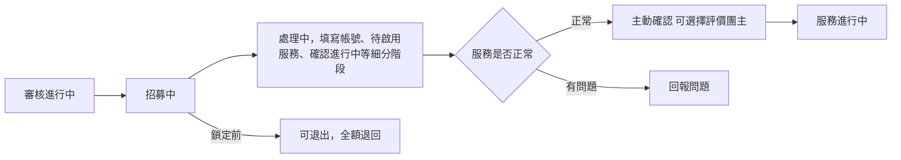

# 我的訂閱（成員視角）

## 使用者目標
成員在申請通過後追蹤自己的訂閱進度：填寫服務帳號、確認服務是否正常啟用、有問題時回報，或在群組鎖定前退出。

## 流程圖

## 流程
1. 訂閱列表依狀態分頁顯示：審核進行中、招募中、處理中（涵蓋等待鎖定、成員填寫中、待啟用服務、確認進行中、申訴中等細分階段）、服務進行中
2. **完成服務設定資訊**：群組鎖定後，成員需依服務的 [共享模式](../product/sharing-modes.md) 提供 Email、Apple ID、Google 帳戶、邀請碼等資訊；若是共用帳密服務，則改由團主提供帳密，成員只需提取並確認可用
3. **確認服務**：服務啟用後進入一段確認期，成員可以主動確認服務正常，或在有問題時提出回報；主動確認完成後會提供評價入口，但評價不是必填，也可以之後再補評或更新
4. **回報問題**：確認期內若服務有問題，可以提出正式回報，詳見 [申訴流程](./dispute-flow.md)
5. **退出群組**：僅限群組還沒鎖定（招募中或額滿階段）可以操作，退出會全額退回代管費用

## 產品決策
- **填寫失敗時原樣復原，不清空**：避免使用者辛苦填好的內容因為一次送出失敗就消失
- **只要自己已確認，即使其他成員還沒確認，個人視角也提前顯示為已啟用**：對這位成員來說該做的事已經做完，不需要被其他人的進度卡住視覺狀態
- **不可逆操作（確認服務、退出群組）都需要短暫倒數確認**：避免誤觸

## 驗證重點
- 填寫帳號資訊只有本人或該群組團主可以操作
- 退出群組只允許在群組鎖定前操作
- 確認服務、回報問題都需要確實是該群組成員、且群組正處於確認期
