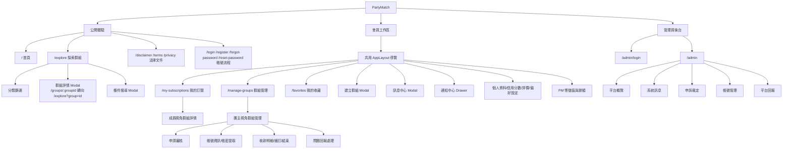

# 資訊架構圖

## 目標

PartyMatch 的 IA 需要同時支援三種心智模型：

1. **先探索再決定**：訪客可以先理解服務與瀏覽招募中的群組，真正要申請、收藏、私訊時才登入。
2. **同一帳號可切換成員與團主視角**：使用者可能在 A 群組是成員，在 B 群組是團主，因此資訊架構不能把角色切成兩個互斥產品。
3. **交易狀態比頁面更重要**：群組從招募、等待鎖定、填寫資訊、待啟用服務、確認進行中、服務進行中到續訂/結束，畫面需要依狀態改變主操作。

## 全站資訊架構

## 導覽層級

| 層級 | 內容 | 設計意圖 |
|---|---|---|
| L0 全站入口 | 首頁、探索群組、登入/註冊、法律文件 | 讓未登入者可以先理解產品與瀏覽供給 |
| L1 會員主導覽 | 探索群組、條件搜尋、建立群組、群組管理、我的訂閱、我的收藏 | 以任務而非角色命名，因為同一使用者可以同時是團主與成員 |
| L2 全域工具 | 通知、訊息、PM 幣、主題切換、使用者選單 | 不綁定單一路由，使用者在任何頁面都能處理即時任務 |
| L3 交易工作區 | 群組詳情、成員視角、團主視角、申請審核、帳號資訊、收款明細 | 依群組狀態顯示不同操作，透過 Modal/面板降低換頁成本 |
| L4 管理後台 | 平台概覽、系統訊息、帳號管理、平台回報、申訴裁定 | 與一般使用者產品分離，避免權限與心智模型混淆 |

## 主要內容物件

| 物件 | 使用者理解 | 主要出現位置 |
|---|---|---|
| 服務 Service | Netflix、Spotify、YouTube Premium 等可合購標的 | 首頁、探索、條件搜尋、建立群組 |
| 方案 Plan | 服務下的月繳/年繳、席位數、價格與特色 | 群組卡片、群組詳情、建立群組 |
| 群組 Group | 一次共享訂閱交易的核心容器 | 探索、我的訂閱、群組管理、通知、訊息 |
| 申請 Application | 使用者加入群組前的審核與代管扣款紀錄 | 群組詳情、我的訂閱、群組管理 |
| 成員 Member | 申請通過後的席位與服務資訊狀態 | 我的訂閱、團主群組管理 |
| PM 幣 Token | 平台內部餘額、代管、退款與撥款單位 | PM 幣 Modal、申請流程、收款明細 |
| 對話 Conversation | 群組聊天室、私人 DM、系統通知聊天室 | 訊息中心 |
| 通知 Notification | 可點擊的任務入口與歷史紀錄 | 通知中心、導覽未讀數 |
| 申訴 Dispute | 服務異常與金流裁定紀錄 | 成員群組詳情、團主管理、管理後台 |
| 評價 Review | 合作結束後的信任回饋 | 個人評價、信用分數、群組詳情 |

## 權限與可見性

| 身分 | 可見內容 | 被鎖定或限制的內容 |
|---|---|---|
| 訪客 | 首頁、探索群組、條件搜尋、公開公告、法律文件 | 收藏、申請、建立群組、訊息、PM 幣、我的訂閱、群組管理 |
| 已登入使用者 | 會員主導覽全部功能，依群組關係顯示成員或團主操作 | 非自己群組的敏感資訊、非參與對話、非本人交易紀錄 |
| 群組團主 | 自己建立群組的申請審核、成員資訊、收款明細、續訂/結束 | 其他團主群組的管理操作 |
| 群組成員 | 自己加入群組的服務資訊、確認服務、問題回報、退出條件 | 團主審核/啟用/續訂管理操作 |
| 管理員 | 後台統計、系統訊息、帳號管理、平台回報、申訴裁定 | 一般會員介面的登入狀態不共用 |

## 頁面與 Modal 邊界

| 使用 Page | 使用 Modal/Drawer |
|---|---|
| 需要分享網址、SEO 或明確導航歷史，例如首頁、探索、我的訂閱、群組管理、收藏、法律文件 | 任務短、需保留目前脈絡、或全站可觸發，例如群組詳情、建立群組、條件搜尋、通知、訊息、儲值、帳號設定 |

設計規則：

- **探索群組是公開列表的主要錨點**：分享群組連結時先回到探索頁，再開啟指定群組詳情。
- **會員任務用全域事件開啟 Modal**：建立群組、訊息、通知、帳號面板不綁單一路由，讓使用者不用離開目前工作內容。
- **管理員後台不混入一般導覽**：後台使用獨立登入、路由守衛與 layout。
- **舊路由只做相容轉向**：`/create-group`、`/quick-match`、`/account`、`/my-groups` 保留轉向，不作為新的 IA 節點。

## 服務分類架構

探索與建立群組共用相同服務分類，降低使用者在「找團」與「開團」之間的認知切換。

| 分類 | 用途 |
|---|---|
| 套組 | 多服務或家庭整合型方案 |
| 影音 | 串流影音訂閱 |
| 音樂 | 音樂串流訂閱 |
| AI 工具 | AI 生產力工具 |
| 辦公 | 團隊/文件/設計工作工具 |
| 雲端 | 儲存與雲端空間 |
| 學習 | 課程、語言與知識內容 |
| 遊戲 | 遊戲會員或家庭方案 |
| VPN | VPN 與安全工具 |

## IA 設計重點

- **把「探索」放在公開層，把「交易管理」放在登入後工作區**：訪客能先建立信任與需求，降低註冊門檻。
- **將成員與團主視角並列**：`我的訂閱` 與 `群組管理` 是同層入口，符合一人多角色的使用情境。
- **用通知連回任務，而不是只做訊息堆疊**：通知點擊後會換頁並開啟對應 Modal/面板，減少使用者自行搜尋。
- **把金流、帳號資訊、申訴納入群組狀態下的子任務**：避免它們看起來像獨立功能，實際上卻依賴同一筆群組交易。
