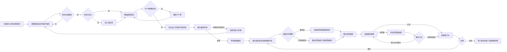
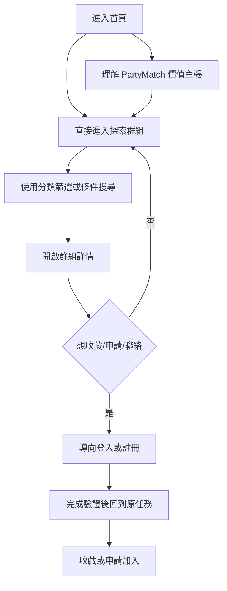
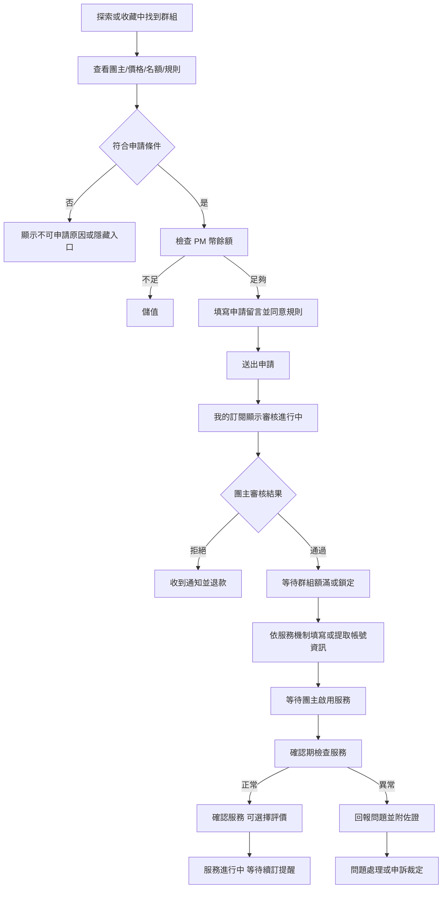
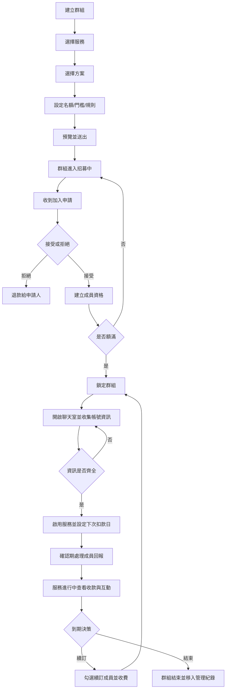
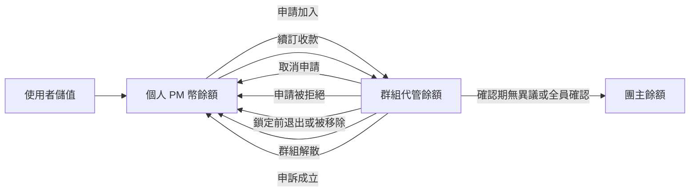
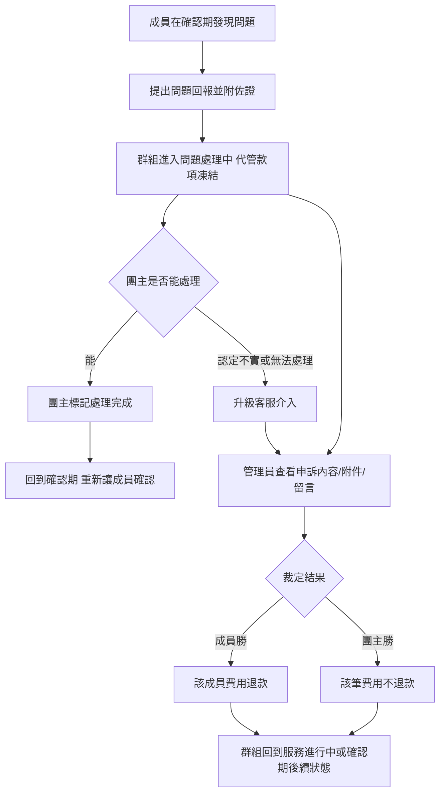
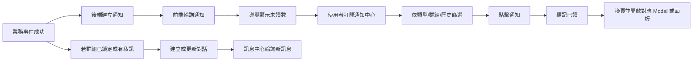
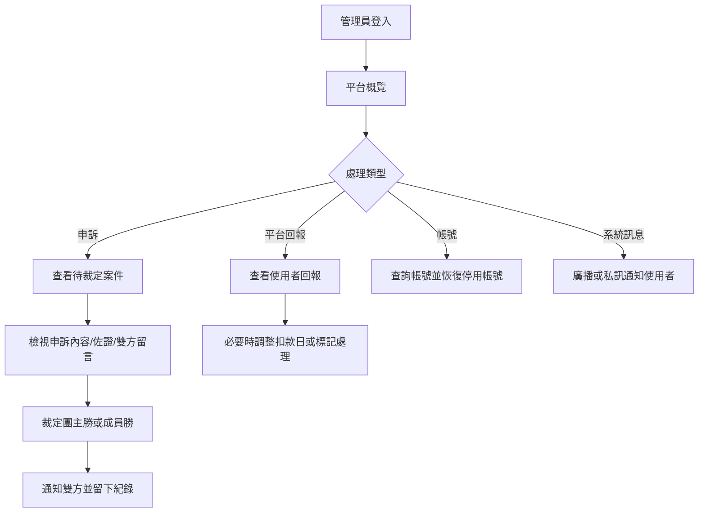

# 使用者流程圖

這份文件整理跨角色、跨頁面的主流程。單一功能的細節仍以 `docs/flows` 下的文件為主。

## 端到端核心流程

## 訪客到會員流程

設計重點：

- 訪客可以先使用探索與條件搜尋，讓產品價值先被看見。
- 被鎖定的功能要明確告知「登入後可使用」，並提供前往登入的動作。
- 登入後應盡量回到原本被中斷的任務，而不是只回首頁。

## 成員流程

主要入口：

- `/explore` 群組卡片
- `/favorites` 收藏群組
- 通知中心點擊申請結果或待處理通知
- `/my-subscriptions` 查看審核進行中、處理中、服務進行中與歷史紀錄

## 團主流程

主要入口：

- 側邊欄或 Drawer 的「建立群組」
- `/manage-groups` 群組管理列表
- 通知中心的「新申請」「群組額滿」「成員資訊已填寫」「回報問題」等通知

## PM 幣與金流流程

設計重點：

- 使用者看到的是「我付出的錢正在被平台代管」，不是直接付給團主。
- 任何退款、撥款、凍結都要跟群組狀態同步顯示，避免成員或團主對金流去向產生不信任。

## 申訴與客服流程

## 通知與訊息流程

設計重點：

- 通知是任務入口，不只是紀錄。
- 訊息中心處理日常溝通；通知中心處理狀態變更與待辦。
- 對於會改變目前列表的事件，以提示加手動刷新為主，避免背景資料突然換掉造成認知中斷。

## 管理員流程

## 例外與復原路徑

| 情境 | UX 處理 |
|---|---|
| 群組卡片狀態過期 | 點開群組前重新查證；若已不可申請，提示重新整理或導回列表 |
| 申請時餘額不足 | 不開表單或阻止送出，引導儲值 PM 幣 |
| 申請被拒絕/取消 | 通知使用者、退回代管款項、保留再次探索路徑 |
| 群組鎖定前退出 | 顯示不可逆確認，成功後全額退款 |
| 成員逾期未填資料 | 群組轉進待處理狀態，不移除任何成員，團主可延長期限或協助處理 |
| 團主逾時未啟用 | 群組轉進啟用逾期狀態，不退回額滿，團主可補按啟用，成員也能提醒團主或回報問題 |
| 續訂時有人餘額不足 | 整批續訂失敗，團主看到不足名單 |
| 申訴進入客服介入 | 明確改變狀態文案，雙方知道已不再是一般確認期 |
